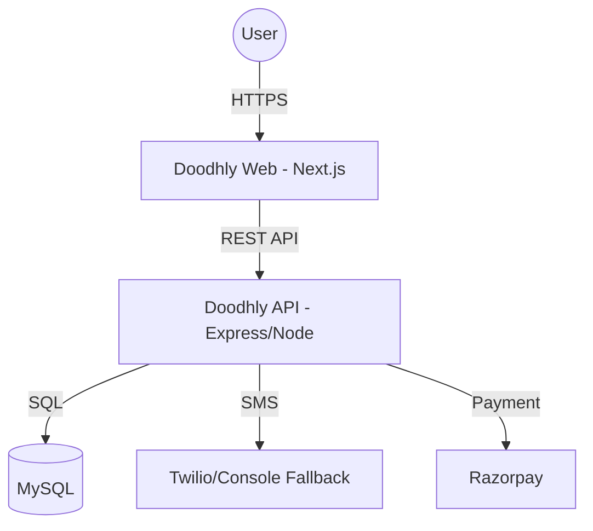

# Doodhly System Architecture

## Overview
Doodhly is a milk subscription platform designed for multi-city operations. It follows a modular monolith architecture for the backend and a modern Next.js App Router structure for the frontend.

## Architecture Diagram

## Core Components

### 1. Backend (Modular Monolith)
Located in `/backend`.
- **Modules**:
  - `auth`: OTP-based authentication and JWT management.
  - `customer`: Profile, wallet, and subscription management.
  - `delivery`: Automated delivery schedule generation and verification.
  - `payment`: Razorpay integration for wallet recharges.
  - `notification`: SMS and WhatsApp service communication.
- **Core**: Contains shared middleware, error handling, and database connection logic.

### 2. Frontend (Next.js)
Located in `/doodhly-web`.
- **App Router**: Uses group routes (e.g., `(customer)`, `(partner)`) for logical separation.
- **State Management**: React Context (`AuthContext`) for user session.
- **Components**: UI primitives and feature-specific components.
- **Offline Support**: Partner routes implement local storage queuing for delivery verification in low-connectivity areas.

## Data Flow
1. **Subscription**: User selects a product → Sets schedule → Funds wallet.
2. **Delivery Generation**: Nightly jobs generate `deliveries` from active `subscriptions`.
3. **Delivery Execution**: Partner logs in → Views route → Delivers milk → Verifies via OTP (or state-locked QR).
4. **Reconcilation**: Delivery completion triggers wallet deduction.
