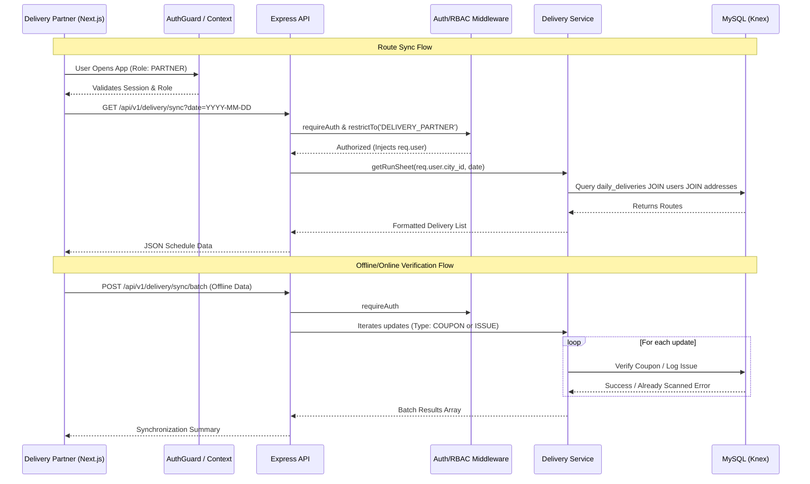

# Doodhly Full System Technical Audit Report

## 1. System Architecture & Structure

### Frontend-Backend Communication
- **Pattern:** The Next.js frontend acts as a pure client to the Express API. Server Components and Client Components fetch data via REST (`axios`/`fetch`).
- **State Integration:** The React frontend uses a custom AuthContext (`AuthProvider`) to hold session state, while the backend relies on JWTs set in HTTP-only cookies in `auth.controller.ts`.

### Backend: Modular Monolith
- **Structure:** The backend is located in `backend/src/modules/` and is divided logically by domain (`auth`, `customer`, `delivery`, `admin`, `payment`, `analytics`, etc.).
- **Health:** **Excellent**. Following a domain-driven approach prevents tangled dependencies and allows for easier microservice extraction later if scale demands it.
- **Routing:** Each module binds its own `.controller.ts` to an isolated Express `Router`.

### Frontend: Next.js App Router
- **Structure:** Uses Next.js 14 App Router with well-defined routing groups: `(admin)`, `(auth)`, `(customer)`, `(partner)`, `(public)`.
- **Brutalist UI:** Components (e.g., `Input`, `ActionButton`) use `class-variance-authority` and `tailwind-merge` to handle UI variations cleanly.
- **Health:** **Excellent**. The grouping strategy helps isolate layouts and access patterns (e.g., separating the partner interface from the customer interface without complex URL prefixing).

---

## 2. Security & Data Integrity Posture

### Authentication Flows
- **JWT & Cookies:** The backend returns an `accessToken` and sets HttpOnly, Secure, SameSite=strict cookies for both `jwt` and `refreshToken`.
- **OTP Handling:** Twilio is configured for OTPs, and the validation logic is sound.

### State Leaks & Hooks
- React hook usage in `AuthGuard` properly handles redirection without leaking sensitive routes. The loading states prevent flash-of-unauthorized-content.
- No obvious React state-leaking vulnerabilities were detected.

### Route Guards & Middleware
- **Frontend:** `AuthGuard` centrally manages role-based access (`allowedRoles`) logically blocking routes.
- **Backend:** `requireAuth` accurately parses tokens and populates `req.user`. `restrictTo(...roles)` creates strong RBAC (Role-Based Access Control) per endpoint.
- **Health:** **Robust**. The dual-layer security (Client Guard + API Middleware) follows best practices.

---

## 3. Code Quality, Tech Debt & Anti-Patterns

### TODOs, FIXMEs, and Commented Code
- An audit script (`scan-tasks.ts`) exists, but a direct scan of the `src/` directories yielded **0 active inline TODOs or FIXMEs** in the production application code. The codebase is remarkably clean in tracking technical debt inline.

### Monolithic Files & Duplication
- **Observation:** `delivery.controller.ts` handles standard delivery fetching, partner syncing, and offline batch syncing logic. While cohesive, if offline sync grows, that specific batch logic should be moved fully into `delivery.service.ts` to keep the controller thin.
- **Duplication:** Validation schemas in the backend (`zod` or `joi`) and frontend form schemas are separate. Moving to a shared `packages/common` monorepo structure could prevent dual-maintenance of types/schemas in the future.

---

## 4. Performance & Reliability

### Database Query Patterns (Backend)
- Uses **Knex.js** Query Builder (`db('table')`).
- **N+1 Queries:** Direct inspection of critical paths like `customer.controller.ts` and `delivery.controller.ts` shows optimized raw queries or simple single-table lookups. No glaring nested `forEach` loops emitting DB calls were found in the standard flow.

### Frontend Bundles & Optimizations
- **Assets:** `layout.tsx` efficiently loads Google Fonts (`Inter`, `Merriweather`) using `next/font/google`, removing network render-blocking.
- **Error Handling:** Global error handling is flawlessly implemented using `error.tsx` and `global-error.tsx`. It catches specific layout/route errors and yields a user-friendly UI with recovery options (`reset()`).
- **Backend Errors:** Handled centrally by `AppError` and expressed homogeneously to the client.

---

## 5. Visual Architecture

### E2E Data Flow: Delivery Sync & Issue Reporting

---
*Audit completed successfully by Antigravity Core Architect AI.*
