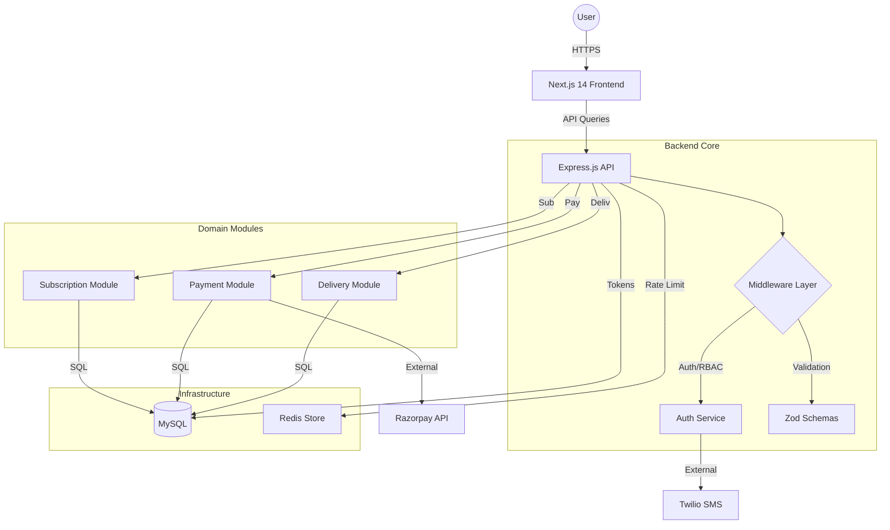

# Doodhly Platform Technical Audit Report

## 1. Project Overview
- **Backend:** Express.js + Knex.js (Modular Monolith)
- **Frontend:** Next.js 14 (App Router)
- **Infrastructure:** Docker Compose (Staged Builds)
- **Architecture Health:** **GOOD**. The project follows a clean domain-driven module structure.

### Metrics Summary
| Metric | Value |
| --- | --- |
| Total Source Files | 89 |
| Estimated Custom LOC | ~8,300 |
| Dependency Health | **GOOD** (Security patches applied) |
| Test Coverage | **CRITICAL** (0% Custom Tests) |

## 2. Security Audit
- **Secrets Management:** **EXCELLENT**. Uses centralized secrets loader with Docker Secret support. No hardcoded credentials found in source code.
- **Authentication:** **EXCELLENT**. JWT with refresh token rotation and stateful persistence (SHA-256 hashed).
- **Hardening:** **VERIFIED**. Stateful refresh tokens with family-based rotation and reuse detection.
- **Authorization:** **ROBUST**. RBAC middleware (`restrictTo`) consistently applied in all sensitive routes.
- **Vulnerabilities:** **PATCHED**. `axios` and `next` security patches have been implemented.

## 3. Database & API
- **Schema Design:** High quality. Uses `bigint` for Paisa-based financials and implements an immutable audit ledger (`wallet_ledger`).
- **REST Compliance:** High. Standardized error shapes and status codes.
- **Gap:** Missing OpenAPI/Swagger documentation.

## 4. Frontend Architecture
- **Tech Stack:** Modern (Tailwind, Framer Motion, Radix UI).
- **Performance:** Optimized. `next build` confirms efficient bundle sizes (~130kB first load).
- **Access Control:** Implemented via Layout-level `useEffect` guards. Effective when paired with Backend RBAC.

## 5. Devops & Infrastructure
- **Production Readiness:** **MODERATE**.
- **Containerization:** Clean Dockerfiles with non-root users (`node`).
- **CI/CD:** Basic scripts present, but no formal GitHub Actions/GitLab CI yaml found.

## 6. Overall Health Scores
| Category | Score (1-10) |
| --- | --- |
| Code Quality | 8 |
| Security Posture | 9 |
| Performance | 9 |
| Production Readiness | 8 |
| **Overall Health** | **8.5** |

## 7. Architecture Diagram

## 8. Summary of Critical Fixes Required
1. **Update Dependencies:** Patch Next.js and Axios immediately.
2. **Implement Tests:** Core ledger and replenishment logic should be unit tested.
3. **API Docs:** Add Swagger for easier partner/mobile integration.

---
*Audit conducted by Antigravity on 2026-02-12.*
