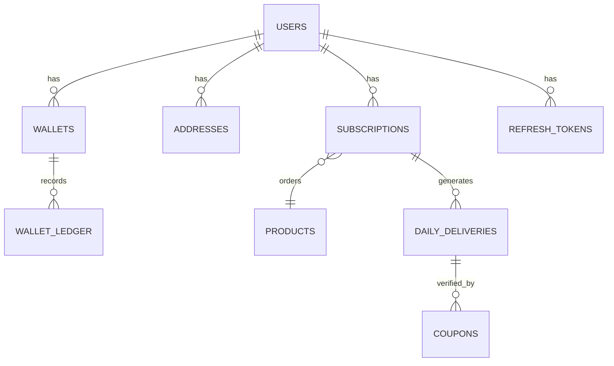

# Doodhly Platform Technical Blueprint

**Version:** 1.0.0
**Last Updated:** 2026-02-12
**Status:** Active Development / Pilot Phase

---

## 1. PROJECT METADATA

### 1.1 Repository Structure
```text
.
├── backend/                # Express.js API Server
│   ├── migrations/         # Knex Database Migrations
│   ├── src/
│   │   ├── config/         # Environment & Service Configs
│   │   ├── core/           # Middleware, Errors, Utilities
│   │   ├── modules/        # Domain Logic (Auth, Customer, etc.)
│   │   ├── app.ts          # Express App Setup
│   │   └── server.ts       # Server Entry Point
│   └── Dockerfile
├── doodhly-web/            # Next.js 14 Frontend
│   ├── src/
│   │   ├── app/            # App Router (Pages & Layouts)
│   │   ├── components/     # React Components
│   │   ├── context/        # Global State (Auth)
│   │   └── lib/            # Utilities & API Client
│   └── Dockerfile
└── docker-compose.yml      # Orchestration Config
```

### 1.2 Technology Stack

| Layer | Technology | Version | Key Libraries |
|-------|------------|---------|---------------|
| **Frontend** | Next.js | 14.x | TailwindCSS, Framer Motion, Lucide React |
| **Backend** | Node.js (Express) | 18.x | Knex, Joi, Zod, JsonWebToken |
| **Database** | MySQL | 8.0 | MySQL2 Driver, Redis (Cache/RateLimit) |
| **DevOps** | Docker | Compose | Docker Secrets, Multi-stage builds |

### 1.3 Prerequisites
- **Node.js:** v18.17.0+
- **NPM:** v9.6.0+
- **Docker:** Engine 24.0+

### 1.4 Environment Variables Checklist

**Backend (.env)**
- [x] `NODE_ENV` (development/production)
- [x] `PORT`
- [x] `DB_HOST`
- [x] `DB_USER`
- [x] `DB_PASSWORD`
- [x] `DB_NAME`
- [x] `CORS_ORIGIN`
- [x] `REDIS_URL`
- [x] `JWT_SECRET_FILE` (Docker Secret path)
- [x] `JWT_REFRESH_SECRET_FILE`
- [x] `RAZORPAY_KEY_ID_FILE`
- [x] `TWILIO_ACCOUNT_SID_FILE`

**Frontend (.env.local)**
- [x] `NEXT_PUBLIC_API_URL`

---

## 2. BACKEND ARCHITECTURE (Express.js)

### 2.1 Entry Points & Configuration

**`src/server.ts`**
The entry point responsibility is strictly limited to:
1.  Loading Environment Variables (`dotenv`).
2.  Validating Environment Configuration (`Joi` schema).
3.  Validating Secrets (`validateSecrets()`).
4.  Connecting to Database.
5.  Starting the HTTP Listener.

**`src/app.ts`**
Orchestrates the middleware pipeline:
1.  **Validation:** `validateCorsConfig()` checks production safety.
2.  **Parsers:** `express.json()`, `cookieParser()`.
3.  **Security:** `cors(corsOptions)`, `helmet()` (Strict CSP in prod).
4.  **Logging:** `morgan` (HTTP request log), `auditLog` (User mutations).
5.  **Rate Limiting:** Global `generalLimiter`.
6.  **Routes:** Mounted with specific limiters (e.g., `otpRequestLimiter`).
7.  **Error Handling:** Global error middleware (converts unknown errors to 500).

**Configuration Strategy (`src/config/`)**
-   **`env.ts`**: Centralized config object. Enforces `CORS_ORIGIN` checking.
-   **`secrets.ts`**: Hybrid loader. Prioritizes `/run/secrets/<name>` (Docker) -> Fallback to `process.env`.
-   **`db.ts`**: Knex instance initialization with connection pooling.

### 2.2 Authentication & Security

The system uses a **Stateful JWT** approach for maximum security.

**Core Components:**
-   **Service (`AuthService`)**:
    -   **OTP**: Generates 6-digit code, hashes via SHA-256, stores in `verification_codes`.
    -   **Token Generation**: Issues `accessToken` (15m) and `refreshToken` (7d).
    -   **Rotation**: Refresh tokens are family-linked (UUID). Rotating a token issues a new one in the same family.
    -   **Reuse Detection**: If an old token is used, the *entire family* is revoked.
-   **Controller (`AuthController`)**:
    -   **Cookies**: Tokens sent as `HttpOnly`, `Secure`, `SameSite=Strict`.
    -   **Path**: Refresh cookie restricted to `/api/v1/auth/refresh`.

**Middleware (`core/middleware/`)**
-   **`rate-limiter.middleware.ts`**:
    -   Backed by **Redis** (`rate-limit-redis`).
    -   **Tiers**:
        -   General: 100 req/min
        -   OTP Request: 5 req/15min
        -   OTP Verify: 10 req/15min
        -   Wallet: 30 req/min
-   **`auth.middleware.ts`**:
    -   **`requireAuth`**: Validates JWT from Header OR Cookie. Attaches user to `req.user`.
    -   **`restrictTo`**: RBAC check (e.g., `restrictTo('ADMIN')`).

### 2.3 Domain Modules

**1. Customer Module**
-   **Wallet**: `WalletController`, `PaymentService`. Handles balance, transactions.
-   **Subscriptions**: `SubscriptionService`. CRUD for daily milk plans.
-   **Profile**: `CustomerController`. Address management, onboarding.

**2. Delivery Module**
-   **Run Sheet**: `DeliveryService`. Generates daily list based on active subscriptions.
-   **Verification**: `DeliveryVerificationService`. Handles coupon scanning and issue reporting.
-   **Offline Sync**: Batch endpoint for uploading offline delivery records.

**3. Admin Module**
-   **Jobs**: `JobsController`. Triggering daily batch generation manually.
-   **Analytics**: Stats on deliveries and revenue.

### 2.4 Database Layer

**Migrations Directory: `migrations/`**
-   `20240115...create_users_table`: Core user identity.
-   `20260120...harden_core_schema`: Main schema (Wallets, Products, Subs, Deliveries).
-   `20260212...create_refresh_tokens_table`: Stateful auth persistence.

**Schema Design Principles**
-   **Financials**: All monetary values stored as `INTEGER` or `BIGINT` in **Paisa** (lowest unit).
-   **Audit**: `wallet_ledger` table is append-only. No updates allowed.
-   **Integrity**: Heavy use of Foreign Key constraints (`ON DELETE CASCADE` or `RESTRICT`).

### 2.5 Cross-Cutting Concerns

-   **Error Handling**: `AppError` class extends `Error`. Operational errors have HTTP codes.
-   **Logging**: `winston` for app logs, `morgan` for HTTP.
-   **Validation**: `zod` schemas for inputs, validated via `validate()` middleware.

---

## 3. FRONTEND ARCHITECTURE (Next.js 14)

### 3.1 App Router Structure

```text
src/app/
├── (public)/           # Marketing pages (Home, Products)
├── (auth)/             # Login, Verify pages
├── (customer)/         # Protected Customer Dashboard
│   ├── layout.tsx      # Sidebar, Auth Check
│   ├── dashboard/      # Main View
│   └── wallet/         # Recharge & History
├── (admin)/            # Admin Panel
└── layout.tsx          # Root Layout (Fonts, Providers)
```

### 3.2 Core Configuration

**`layout.tsx`**
-   **Fonts**: Inter (Sans), Merriweather (Serif).
-   **Providers**: `AuthProvider` wraps the app for session context.
-   **Directives**: Global CSS import.

**`tailwind.config.ts`**
-   **Theme**: Custom "Doodhly" palette (Brand Cream, Blue, Green).
-   **Animations**: extensive 3D transforms (`tilt`, `flip`), glassmorphism utilities.

### 3.3 State Management

-   **Authentication**: React Context (`AuthContext.tsx`).
    -   Manages `User` object.
    -   Handles Session Refresh (periodic heartbeat).
    -   Provides `useAuth`, `useAdmin`, `usePartner` hooks.
-   **Data Fetching**: Native `fetch` wrapper (`lib/api.ts`).
    -   Automatic header injection (Auth, ngrok-skip).
    -   Centralized error handling (redirects on 401).

### 3.4 Component Architecture

-   **`components/ui`**: Atomic design elements (Button, Card, Input).
-   **`components/3d`**: Framer Motion powered visual components (`TiltCard`).
-   **`components/layouts`**: `Sidebar`, `Navbar`.

---

## 4. API CONTRACTS

### 4.1 Authentication Endpoints

| Method | Path | Request | Auth | Description |
| :--- | :--- | :--- | :--- | :--- |
| `POST` | `/auth/otp` | `{ phone }` | No | Request 6-digit OTP |
| `POST` | `/auth/login` | `{ phone, otp }` | No | Exchange OTP for Tokens |
| `POST` | `/auth/refresh` | `{ refreshToken? }` | No | Rotate Access/Refresh Tokens |
| `GET` | `/auth/me` | - | Yes | Get Current User Profile |

### 4.2 Customer Endpoints

**Profile & Onboarding**
| Method | Path | Description |
| :--- | :--- | :--- |
| `GET` | `/customer/profile` | Get logged-in user details |
| `PUT` | `/customer/profile` | Update name/email |
| `POST` | `/auth/onboarding` | Submit initial profile & address |

**Address Management**
| Method | Path | Description |
| :--- | :--- | :--- |
| `GET` | `/customer/addresses` | List all saved addresses |
| `POST` | `/customer/addresses` | Add new address |
| `PUT` | `/customer/addresses/:id/geotag` | Update lat/lng for address |
| `DELETE` | `/customer/addresses/:id` | Remove address |

**Subscriptions**
| Method | Path | Description |
| :--- | :--- | :--- |
| `GET` | `/customer/products` | List active products & prices |
| `GET` | `/customer/subscriptions` | List user's active plans |
| `POST` | `/customer/subscriptions` | Create new subscription |
| `PATCH` | `/customer/subscriptions/:id/pause` | Pause plan (dates required) |
| `PATCH` | `/customer/subscriptions/:id/resume` | Resume paused plan |

**Wallet & Payments**
| Method | Path | Description |
| :--- | :--- | :--- |
| `GET` | `/customer/wallet` | Get current balance |
| `GET` | `/customer/wallet/ledger` | Get transaction history |
| `POST` | `/payment/topup/init` | Initialize Razorpay order |

### 4.3 Partner Endpoints

**Delivery Operations**
| Method | Path | Description |
| :--- | :--- | :--- |
| `GET` | `/delivery/sync` | Download daily run sheet (requires date) |
| `POST` | `/delivery/verify` | Verify coupon code (Online) |
| `POST` | `/delivery/report-issue` | Report undelivered reason |
| `POST` | `/delivery/sync/batch` | Upload offline actions (Bulk) |

### 4.4 Admin Endpoints

**Dashboard & Analytics**
| Method | Path | Description |
| :--- | :--- | :--- |
| `GET` | `/admin/summary` | City-wise daily stats |
| `GET` | `/admin/run-sheets` | View daily delivery lists |

**User Management**
| Method | Path | Description |
| :--- | :--- | :--- |
| `GET` | `/admin/customers` | Search customers |
| `POST` | `/admin/customers/:id/wallet-adjust` | Credit/Debit user wallet |
| `PATCH` | `/admin/customers/:id/toggle-status` | Ban/Unban user |

**Product Management**
| Method | Path | Description |
| :--- | :--- | :--- |
| `GET` | `/admin/products` | List all products |
| `POST` | `/admin/products` | Create new product |
| `PATCH` | `/admin/products/:id` | Update price/details |
| `PATCH` | `/admin/products/:id/toggle` | Activate/Deactivate product |

---

## 5. DATABASE SCHEMA

### 5.1 Entity Relationship Diagram



### 5.2 Table Definitions

**Core Identity**
-   **`users`**: `id`, `name`, `phone_hash` (unique), `email`, `role`, `default_city_id`
-   **`auth_otps`** (`verification_codes`): `phone`, `otp_hash`, `expires_at`
-   **`refresh_tokens`**: `id`, `user_id`, `token_hash` (SHA256), `token_family` (UUID), `revoked_at`
-   **`addresses`**: `id`, `user_id`, `street`, `lat`, `lng`, `accuracy`

**Financials**
-   **`wallets`**: `user_id`, `balance` (BigInt, Paisa)
-   **`wallet_ledger`**: `wallet_id`, `amount`, `direction` (CREDIT/DEBIT), `type`, `reference_id` (Immutable)
-   **`payment_transactions`**: `provider_order_id`, `status` (Razorpay Logs)

**Catalog & Subscriptions**
-   **`products`**: `name`, `price_paisa`, `unit`, `is_active`
-   **`subscriptions`**: `user_id`, `product_id`, `quantity`, `frequency_type`, `status`
-   **`subscription_pauses`**: `subscription_id`, `start_date`, `end_date`

**Operations**
-   **`daily_deliveries`**: `subscription_id`, `date`, `status` (PENDING/DELIVERED/MISSED), `debit_amount`, `proof_type`
-   **`coupons`**: `code` (unique), `linked_delivery_id`, `status` (GENERATED/SCANNED), `scanner_id`

### 5.3 Critical Data Flows

**1. Subscription Creation**
1. User selects Product -> POST `/subscriptions`.
2. Backend validates Wallet Balance? (Usually post-paid or daily deduction).
3. Insert `subscriptions` record.

**2. Daily Batch (Job)**
1. Admin triggers Batch.
2. System queries active `subscriptions`.
3. Inserts `daily_deliveries` (status: PENDING) for the date.
4. Generates `coupons` linked to deliveries.

**3. Delivery Verification**
1. Driver scans Coupon code.
2. Backend looks up `coupons` by code.
3. Updates `coupons` -> SCANNED.
4. Updates `daily_deliveries` -> DELIVERED.
5. Updates `wallet_ledger` -> DEBIT User Wallet.

---

## 6. INFRASTRUCTURE & DEVOPS

### 6.1 Docker Configuration

**Backend (`backend/Dockerfile`)**
-   **Base**: `node:18-alpine` (Small footprint).
-   **Build**: Multi-stage (Builder -> Runner).
-   **Security**: Runs as non-root `node` user.

**Frontend (`doodhly-web/Dockerfile`)**
-   **Build**: Standalone output (Next.js request).
-   **Env**: Injects `NEXT_PUBLIC_API_URL` at runtime/build time.

### 6.2 Secrets Management
-   **Production**: Uses **Docker Secrets**. Files mounted at `/run/secrets/`.
-   **Development**: Fallback to `.env` file or hardcoded dev strings (safe ones only).
-   **Rotation**: Change secret in Docker Swarm -> Restart Service.

---

## 7. SECURITY POSTURE

### 7.1 Implemented Protections
-   **[IMPLEMENTED] Rate Limiting**: Distributed Redis-backed limiting (`RedisStore` verified).
-   **[IMPLEMENTED] Helmet**: Sets `X-Frame-Options`, `X-Content-Type-Options`, `HSTS`.
-   **[IMPLEMENTED] CORS**: Strict Origin matching in Production. No wildcards.
-   **[IMPLEMENTED] Input Validation**: Zod middleware verified (`backend/src/core/validation/*.schema.ts`). Joi used for Env validation.

### 7.2 Authentication Security
-   **[IMPLEMENTED] Refresh Token Rotation**: Database backed (`refresh_tokens` table active).
-   **[IMPLEMENTED] Family Revocation**: Logic verified in `auth.service.ts` (Reuse detection triggers family wipe).
-   **[IMPLEMENTED] Secure Cookies**: `HttpOnly`, `Secure`, `SameSite=Strict` flags present in controller.

### 7.3 Known Gaps & Audit Results
-   **[MISSING] MFA**: Only SMS OTP currently. No TOTP or backup codes.
-   **[MISSING] Monitoring**: ELK/Prometheus stack not yet configured in Compose.
-   **[AUDIT] NPM Vulnerabilities**: 2 Issues Found (1 Moderate `lodash`, 1 Low `diff`). High severity issues patched.

---

## 8. DEVELOPER WORKFLOW

### 8.1 Local Development

1.  **Prerequisites**: Install Docker & Node.js.
2.  **Environment**:
    ```bash
    cp backend/.env.example backend/.env
    cp doodhly-web/.env.example doodhly-web/.env.local
    ```
3.  **Start Services**:
    ```bash
    docker-compose up -d redis mysql
    npm run dev --prefix backend
    npm run dev --prefix doodhly-web
    ```

### 8.2 Debugging
-   **Backend**: Logs output to console (Winston pretty print).
-   **Database**: Access via `localhost:3306`. User `root`, Pass `root`.

---

## APPENDICES

### Appendix A: NPM Scripts

**Backend**
-   `start`: Run production build.
-   `dev`: Run with `ts-node` and watch mode.
-   `build`: Compile TS to JS.
-   `migrate:latest`: Run Knex migrations.
-   `migrate:make`: Create new migration file.

**Frontend**
-   `dev`: Start Next.js dev server.
-   `build`: Build application.
-   `start`: Start production server.
-   `lint`: Run ESLint.
